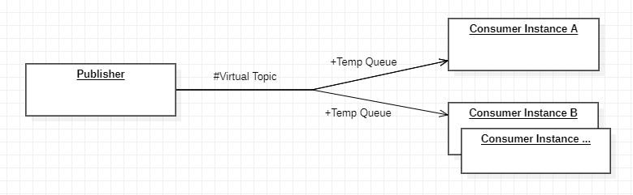

# Java Class - Training Course

## Messaging Lab - JMS and ActiveMQ

#### Author: Herman Rabinkin

This repository contains tasks reference solutions for lab on ActiveMQ.

Each task is on branch task/1, 2, 3 respectively. The description of the
tasks you can find in readme.md on the respective branch.

## Prerequisites:

Download and install classic ActiveMQ of current release for major version 5.
Run it on standard ports with default configuration

## Task 3
Implement case with scaling of topic subscribers (create n subscribers to a topic with the same ClientID).

For instance, you have a consumer subscribed on the topic. When you scale this
consumer, only one for them should receive messages at one time. Try to change
the number of consumer instances dynamically.

Recommended to use Virtual Topics.

